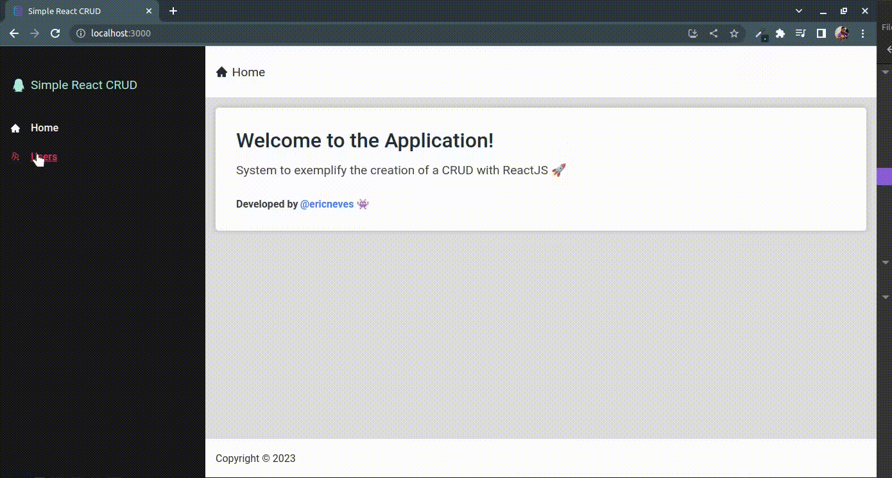
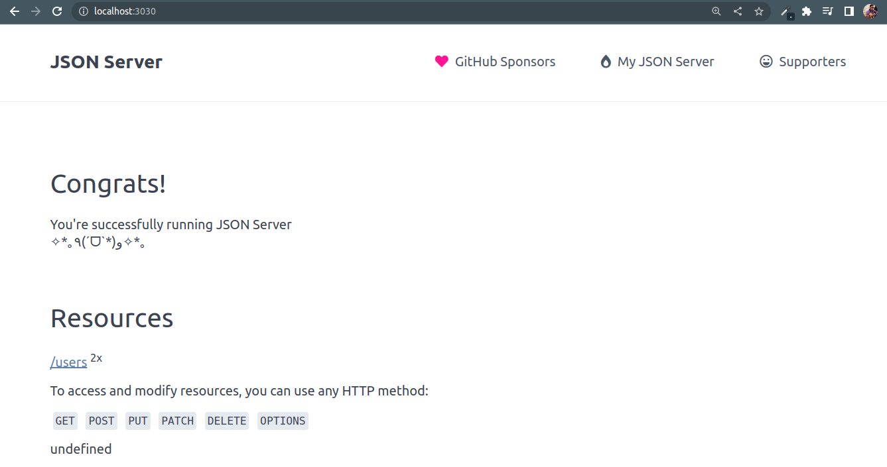

### Simple ReactJS CRUD 🦉

Esse sistema consiste em exemplificar a criação de um <b>CRUD</b> (<b>CREATE, READ, UPDATE & DELETE</b>) com <b>ReactJS</b>.

A aplicação possui <b>2</b> diretórios, <b>backend e frontend</b>, no <b>backend</b> foi utilizado a biblioteca <a href="https://www.npmjs.com/package/json-server"><b>json-server</b></a> para simular uma <b>REST API</b>. Já no <b>frontend</b> por sua vez, foram utilizados <b>ReactJS</b>, <b>CSS</b>, <b>UseEffect</b>, para lidar com o ciclo de vida dos componentes, <a href="https://www.npmjs.com/package/react-router-dom"><b>react-router-dom</b></a>, <a href="https://axios-http.com/ptbr/docs/intro"><b>Axios</b></a>, e entre outros.





#### Executando 🤖

```sh

# Clone
$ git clone https://github.com/EricNeves/simpleReactCRUD.git

# Install Dependencies - Backend
$ cd backend && npm install

# Execute Backend
$ npm start 

# Install dependencies - Frontend
$ cd backend && npm install

# Execute Frontend
$ npm start

```
